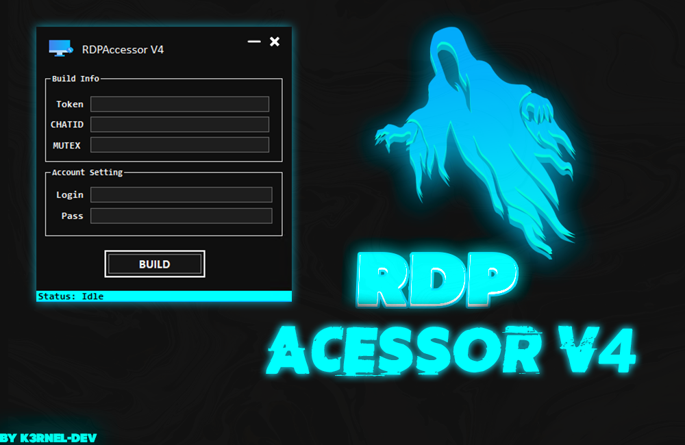
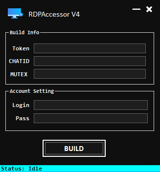

# RDPAccessor V4

## 📑 About
<b>Most simple rdp(accessor), this program have builder for crafting stubs.
 RDPAccessor V4 creating a user in system and sending data to telegram bot.</b>

### 💾 Features:
 * Build Size: 8-13kb✅
 * Self-Delete after send in telegram-bot:✅
 * Simple protect against debuggers/monitors/and etc:✅
 * Simple Anti-VirtualMachine:✅
 * Simple Anti-AnyRun:✅

## 💻 Screens

  
  

 

## How to use?
 * Create bot in telegram: @BotFather and get your chatid with bot @getmyid_bot
 * Put this data in software and enter your desired login password to access rdp-server
 * Final: tap to build and enter path to save exe

 ### 🕸️ Notation (if ):
 > If you decide to rewrite this project, you will need Ilasm for compilation, keep this in mind.
 > The project releases already have a ready-made version for work.

 ### 🃏Updates-Note:
 * CHANGELOG: 15.04.2024
 * Fixed functions
 * Add mutex function in builder
 * Simple change design builder

## ⚠️ Disclaimer - this project for education and purposes only!

## ✨ End
<strong>Thanks for watching</strong>
